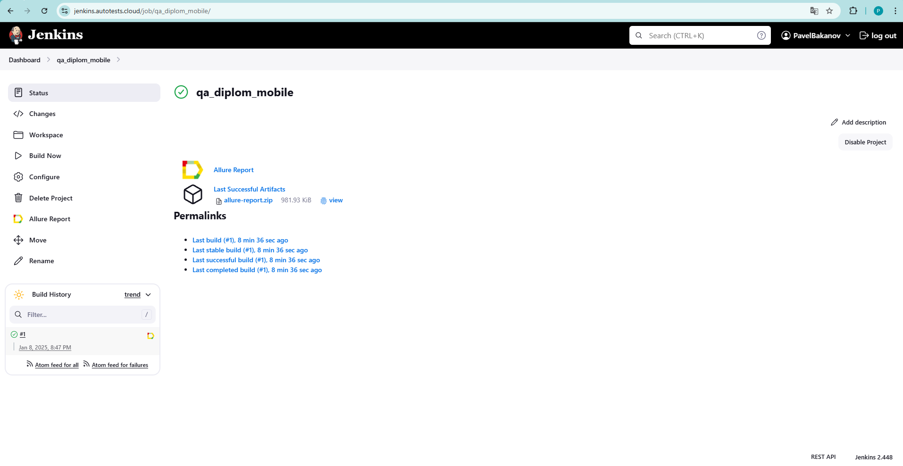
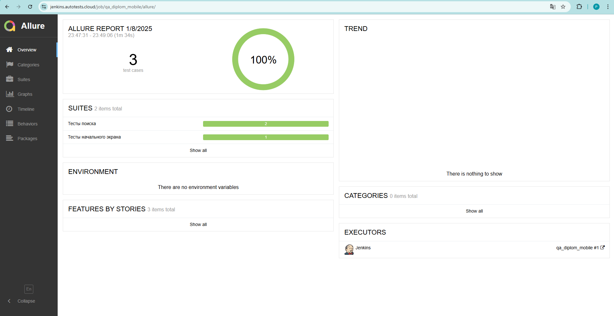
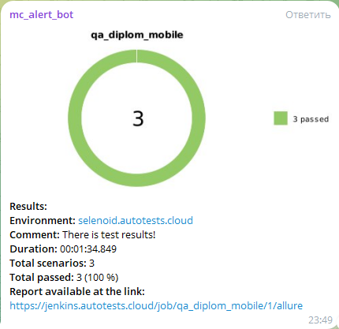
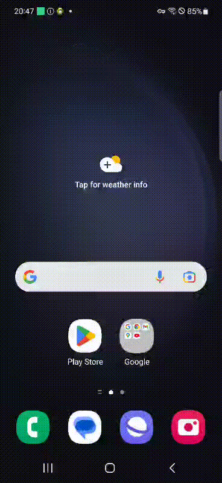
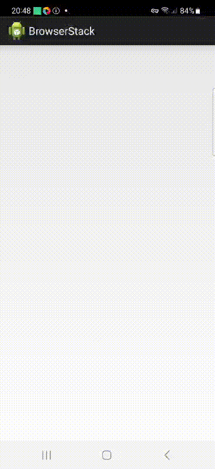
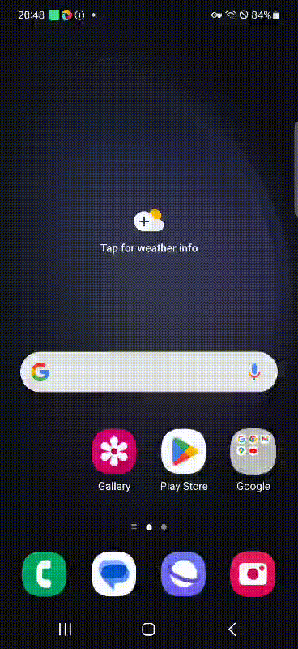

# Тесты приложения Wikipedia на эмуляторе Android устройства и ферме мобильных устройств [browserstack.com](https://www.browserstack.com/) в качестве дипломной работы для qa.guru
## Содержание

* <a href="#tests">Что делают тесты?</a>
* <a href="#tools">Технологии</a>
* <a href="#launch">Запуск</a>
* <a href="#allure">Отчет в Allure</a>
* <a href="#telegramBot">Бот в Telegram</a>
* <a href="#video">Видео прохождения тестов</a>

---

## <a name="Что делают тесты?">**Что делают тесты?**</a>

Три теста, тестирующие функционал приложения.

---

## <a name="Технологии:">**Технологии:**</a>

  
  
  
  
  
  
  
  
  
  
  

---

## <a name="Запуск">**Запуск**</a>

Для запуска локально нужно:
 - Установить [android studio](https://developer.android.com/studio)
 - Прописать настройки:
Параметры Path:
Windows:
%ANDROID_HOME%\tools
%ANDROID_HOME%\tools\bin
%ANDROID_HOME%\platform-tools
Mac:
export ANDROID_HOME=/Users/stanislav/Library/Android/sdk
export PATH=$PATH:$ANDROID_HOME/tools:$ANDROID_HOME/platform-tools
source ~/.bash_profile
- В Android Studio -> SDK Manager скачать 11 андроид (если не скачан по умолчанию)
- В AVD Manager скачать образ Pixel 4 для 11 андроида (если не скачан по умолчанию)
- Запустить эмулятор телефона (Pixel 4, android 11)
- Установить [node.js](https://nodejs.org/en/download)
- Установить [Appium Server](https://github.com/appium/appium)
- Открыть консоль и прописать там:
npm install -g appium@next для установки Appium Server и appium driver install uiautomator2 для установки uiautomator2
- Установить [Appium Ispector](https://github.com/appium/appium-inspector)
- Открыть его, и в качестве конфига прописать там:
- {
  "platformName": "Android",
  "appium:deviceName": "Pixel 4 API 30",
  "appium:automationName": "UiAutomator2"
  }
- Запустить Appium Server командой из консоли appium server --base-path /wd/hub
- В терминале IDE запустить проект командой ./gradlew clean wikipedia_test -DdeviceHost=emulation 

Так же тесты можно запустить через [Jenkins](https://jenkins.autotests.cloud/job/qa_diplom_mobile/). Они запустятся на ферме BrowserStack

---

## <a name="Отчет в Allure">**Отчет в Allure**</a>

После выполнения тестов можно посмотреть отчет в [Allure](https://jenkins.autotests.cloud/job/qa_diplom_mobile/allure/)
### На скриншоте один из результатов выполнения тестов:

---

## <a name="Бот в Telegram">**Бот в Telegram**</a>

После выполнения отчета результат так же предоставит бот в Telegram:

    

---

<h1 align="center">Видео прохождения тестов</h1>

   

   

   

